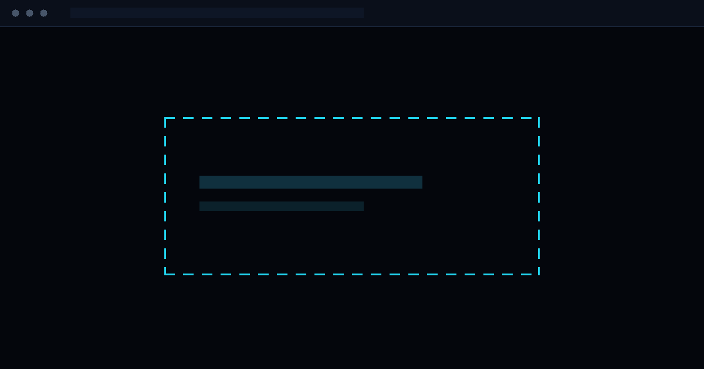

# Fluxo Cloud

Landing page one-page de una agencia de diseño web y automatización con IA, con el flujo de n8n que capta y puntúa los leads y el panel interno para trabajarlos. React 19 y Vite, tres dependencias, 81 KB de JavaScript inicial.



**[Ver la demo en vivo →](https://www.fluxocloudlabs.net/)**


## El problema

Una agencia pequeña recibe pocos leads y no puede permitirse perder ninguno. Lo habitual es una web que tarda en cargar en un móvil con mala cobertura y un formulario que dispara un correo suelto, que alguien acaba leyendo dos días tarde.

Aquí la web carga con 81 KB de JavaScript y el formulario entra en un flujo de n8n que valida, puntúa y clasifica cada solicitud en menos de dos segundos, avisa al equipo y la deja en un panel interno con su prioridad y su plazo. Pensado para negocios que trabajan los leads a mano y necesitan saber a cuál llamar primero.

## Resultado

De la primera versión a la actual, tras partir el sitio por vistas y quitar la librería de animación:

| | Antes | Ahora |
| --- | --- | --- |
| JavaScript inicial | 133 KB gzip | **81 KB gzip** |
| Dependencias | 4 | 3 |
| Vistas | todo en un archivo | 4 chunks aparte |

## Stack

| Pieza          | Tecnología                       |
| -------------- | -------------------------------- |
| UI             | React 19                         |
| Bundler        | Vite 7                           |
| Estilos        | Tailwind CSS 4 (configuración CSS-first en `src/index.css`) |
| Animaciones    | CSS + IntersectionObserver (sin librería) |
| Iconos         | lucide-react                     |

Tres dependencias en total, y cada vista se descarga aparte cuando se pide.

Sin imágenes externas: todas las ilustraciones (panel del hero, mockups del portafolio, diagrama de flujo) están hechas con CSS y SVG.

## Puesta en marcha

```bash
npm install
```

```bash
npm run dev
```

```bash
npm run build
```

`npm run preview` sirve la carpeta `dist/` ya compilada.

## Estructura

| Carpeta | Qué es |
| --- | --- |
| raíz | Web pública (este documento) |
| [`panel/`](panel/README.md) | Panel interno de leads — proyecto y despliegue aparte |
| [`automations/`](automations/captacion-leads/README.md) | Flujos de n8n: captación, calificación y API del panel |

```
src/
├── App.jsx                     Mapa de vistas, carga diferida y transiciones
├── index.css                   Tokens de diseño, animaciones y utilidades
├── data/site.js                TODO el contenido del sitio (texto, marca, datos)
├── lib/
│   ├── icons.js                Registro de iconos + paleta por acento
│   └── analytics.js            Umami o Plausible, y los eventos de conversión
├── hooks/
│   ├── useHashRoute.js         Enrutado por hash, sin dependencias
│   └── useInView.js            IntersectionObserver para las entradas al scroll
├── views/                      Una vista por entrada del menú
│   ├── Home.jsx                Portada + Servicios + Proceso
│   ├── AutomationView.jsx      Automatización con IA + Beneficios
│   └── Work.jsx                Demos + Equipo
└── components/
    ├── Navbar.jsx              Menú fijo, vista activa, barra de progreso
    ├── Hero.jsx                Titular, CTAs y métricas de confianza
    ├── HeroVisual.jsx          Panel de control futurista animado
    ├── Services.jsx            4 bloques de servicios
    ├── Process.jsx             5 pasos del proceso de trabajo
    ├── Demos.jsx               Demos propias, con filtros por categoría
    ├── Team.jsx                Los tres fundadores
    ├── ProjectMockup.jsx       6 mockups de interfaz en CSS puro
    ├── Automation.jsx          Sección de IA y automatización
    ├── AutomationFlow.jsx      Diagrama de flujo (entradas → motor → salidas)
    ├── Benefits.jsx            "¿Por qué elegirnos?"
    ├── Faq.jsx                 Acordeón accesible
    ├── Contact.jsx             CTA final, canales directos y formulario
    ├── ContactForm.jsx         Formulario con validación
    ├── BookingModal.jsx        Agenda de Cal.com en un modal
    ├── Footer.jsx              Servicios, cómo trabajamos, contacto y legal
    ├── FloatingActions.jsx     Burbuja de WhatsApp + volver arriba
    └── ui/                     Aurora, Reveal, SectionHeading, Button,
                                SpotlightCard, NeuralCanvas
```

## Agenda y analítica

Las dos se activan solas al rellenar su variable en `.env`; vacías, el sitio funciona igual que antes.

**Agenda** (`VITE_CAL_LINK`): con un enlace de Cal.com, "Agendar diagnóstico" abre el calendario en un modal y la reunión queda reservada sin intercambiar mensajes. Se usa un `iframe` en lugar del script de incrustación oficial para no cargar JavaScript de terceros en todas las visitas: solo se descarga al pulsar. El modal lleva un enlace de salida por si el calendario no carga dentro del marco.

**Analítica** (`VITE_ANALYTICS_*`): admite Umami y Plausible, los dos sin cookies y sin banner de consentimiento. Como las rutas van por hash, las vistas se registran a mano en cada cambio; el seguimiento automático contaría una sola página para todo el sitio.

Los eventos de conversión están centralizados en [`src/lib/analytics.js`](src/lib/analytics.js): clic en WhatsApp, apertura de la agenda, envío del formulario, correo y teléfono. Sin proveedor configurado, las llamadas no hacen nada.

Lo más razonable es **Umami autoalojado en el VPS**: gratis y los datos de los visitantes no salen de nuestra máquina.

## Animaciones

No hay librería de animación. Las entradas al hacer scroll son CSS disparado por un `IntersectionObserver` ([`useInView`](src/hooks/useInView.js) + `[data-reveal]` en `index.css`), y todo lo demás son transiciones y `@keyframes`. Solo se animan `opacity` y `transform`, que el navegador resuelve en el compositor.

Cada vista se carga cuando se pide, y se precarga al pasar el ratón por su enlace del menú, así que al pulsar ya suele estar descargada.

## Personalización

### Marca, textos y contacto

Todo vive en [`src/data/site.js`](src/data/site.js): nombre, email, teléfono, WhatsApp, redes, menú, servicios, beneficios, proceso, proyectos, testimonios y FAQ. No hace falta tocar los componentes.

El número de WhatsApp va **solo con dígitos y prefijo de país** (formato de `wa.me`):

```js
whatsapp: '573001234567',
```

### Colores y tipografía

Estética futurista sobre negro profundo, con acentos neón (cian, azul eléctrico, verde), glassmorphism y animaciones de scroll. Todo sale de tokens.

En el bloque `@theme` de [`src/index.css`](src/index.css). Cambiar `--color-neon-cyan`, `--color-neon-green`, etc. repinta el sitio completo, incluidos degradados y resplandores.

### Formulario de contacto

Por defecto **no hay backend**: al enviar se abre WhatsApp con la solicitud ya redactada, y en la pantalla de confirmación se ofrece también el envío por correo.

Para conectar un backend real (webhook de n8n, Formspree, API propia), basta con rellenar la constante al inicio de [`src/components/ContactForm.jsx`](src/components/ContactForm.jsx):

```js
const FORM_ENDPOINT = 'https://tu-webhook.example.com/leads'
```

A partir de ahí el formulario hace `POST` con el JSON de los campos y muestra el mensaje de confirmación estándar.

## SEO

`index.html` incluye idioma `es`, title y meta description, Open Graph, Twitter Card, canonical, `theme-color`, favicon SVG embebido y datos estructurados JSON-LD (`ProfessionalService`).

Antes de publicar conviene actualizar la URL canónica, las de Open Graph y añadir una imagen `og:image` (1200×630).

## Accesibilidad y rendimiento

- Enlace "saltar al contenido" y estados de foco visibles en toda la interfaz.
- Acordeón de FAQ con `aria-expanded` / `aria-controls`, menú móvil con `aria-expanded`.
- `prefers-reduced-motion` desactiva animaciones y reduce las transiciones.
- El lienzo de la red neuronal limita la densidad de nodos, se detiene al salir del viewport y no se ejecuta con movimiento reducido.
- Cero imágenes de mapa de bits; solo se descargan las fuentes de Google Fonts.

## Despliegue

El resultado de `npm run build` es estático. Sirve `dist/` en Vercel, Netlify, Cloudflare Pages, GitHub Pages o cualquier hosting.

Para Vercel o Netlify basta con el comando `npm run build` y el directorio de salida `dist`.
